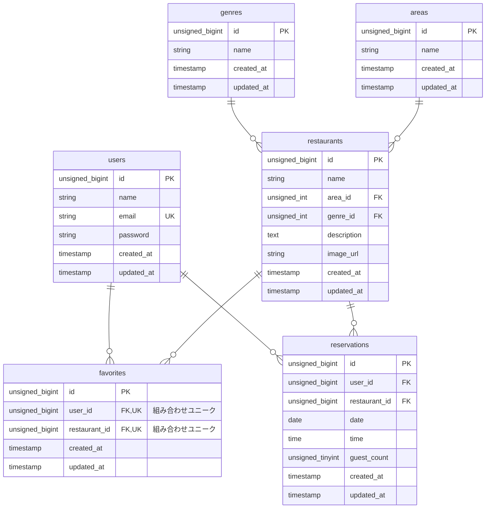

# Rese - 飲食店予約サービス
## 環境構築
### MAC Makefile
1. ```git clone https://github.com/itoro967/Rese.git```
1. ```cd Rese```
1. ```make init```
1. ```docker compose exec php npm run dev```
### 使用技術
- mysql 9.0.1
- nginx 1.27.2
- mailhog latest
- php 8.2-fpm
- Laravel 11
- vite 6.0.11
- React 19.0.0
- tailwind 4.0.15
- inertia 2.0.5

## URL
## 備考

## ルーティング
|パス|内容
|-|-|
|/|飲食店一覧ページ|
|/register|会員登録ページ|
|/thanks|サンクスページ|
|/login|ログインページ|
|/mypage|マイページ|
|/detail/{shop_id}|飲食店詳細ページ|
|/done|予約完了ページ|

## ER図
