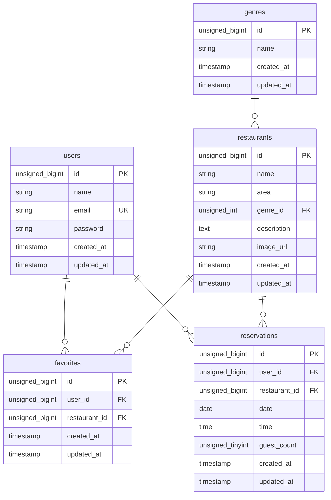

# Rese - 飲食店予約サービス
## 環境構築
### Dockerビルド
### Laravel環境構築
### 使用技術
## URL
## 備考

## ルーティング
|パス|内容
|-|-|
|/|飲食店一覧ページ|
|/register|会員登録ページ|
|/thanks|サンクスページ|
|/login|ログインページ|
|/mypage|マイページ|
|/detail/{shop_id}|飲食店詳細ページ|
|/done|予約完了ページ|

## ER図
