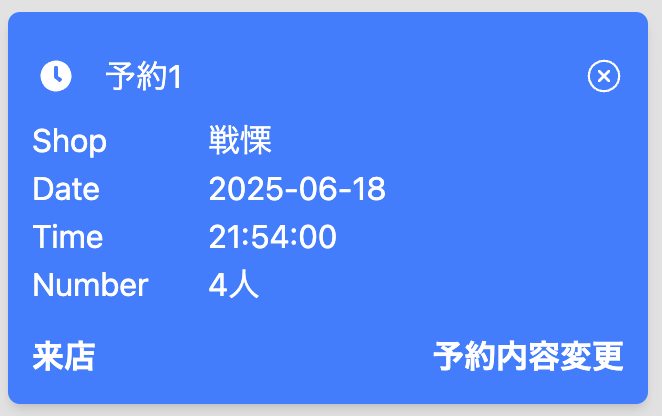

# Rese - 飲食店予約サービス
## アプリケーションURL
- デプロイ(AWS) http://rese-develop.jp/
- 開発環境(docker) [localhost](localhost)
### パス一覧
|パス|説明|備考|
|-|-|-|
|/|トップページ(飲食店一覧)
|/owner/login|店舗代表者ログインページ|リンク直打ちでのみアクセス可能|
|/admin/login|管理者ログインページ|リンク直打ちでのみアクセス可能|

## 機能一覧
- 会員登録
- ログイン機能
- 飲食店一覧表示
- 飲食店詳細表示
- 飲食店お気に入り機能
- 飲食店予約機能(予約、変更、削除)
- 飲食店検索機能(店名、エリア、ジャンル)
- 店舗評価機能(5段階評価)
- 店舗代表者アカウント作成機能
- 店舗情報登録機能

## 環境構築
### MAC Makefile
1. ```git clone https://github.com/itoro967/Rese.git```
1. ```cd Rese```
1. ```make init```
1. ```docker compose exec php npm run dev```
### 使用技術
- mysql 9.0.1
- nginx 1.27.2
- mailhog latest
- php 8.2-fpm
- Laravel 11
- vite 6.0.11
- React 19.0.0
- tailwind 4.0.15
- inertia 2.0.5

## ER図


## アカウント情報
|種類|Email|Password|
|-|-|-|
|一般ユーザー|user@user.jp|password|
|店舗代表者|owner@owner.jp|password|
|管理者|admin@admin.jp|password|

## 備考

### 店舗評価機能について
評価機能では来店したことを予約カード左下の「来店」ボタンを押下することで
擬似的に判断し、評価(レビュー)できるようにした。
